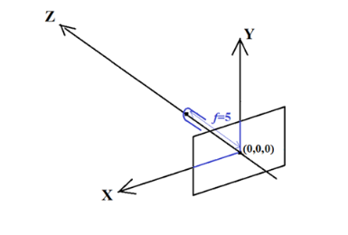

# Zadanie

Dane są dwa nieprzezroczyste trójkąty (A i B) umieszczone w 3D przestrzeni XYZ.
Trójkąty te obserwowane są przez kamerę o ogniskowej f = 5.
Oś kamery pokrywa się z osią OZ, środek obrazu umieszczony jest w punkcie (0,0,0), a
płaszczyzną obrazu jest płaszczyzna OXY (jak na rysunku).

## część 1(a)

Trójkąt A ma narożniki o współrzędnych (2, 0.5, 10), (-1, -1.5, 12), (-1, 1.5, 8). Obie strony
trójkąta mają różne kolory, tzn. czerwony RGB = (255,0,0) z jednej strony i zielony RGB =
(0,255,0) z drugiej strony (wszystko jedno z której strony).
Trójkąt B ma narożniki o współrzędnych (0.5, -2, 10), (-0.5, 2, 11), (1.5, 2, 9). Obie strony
trójkąta mają różne kolory, tzn. niebieski RGB = (0,0,255) z jednej strony i żółty RGB =
(255,255,0) z drugiej strony (wszystko jedno z której strony).

Wyświetl obraz cyfrowy pobrany przez kamerę obserwującą oba trójkąty w powyższej
konfiguracji. Obraz ma mieć rozdzielczość XxY=640x480, a rozmiar pojedynczego pixela to
0.01x0.01.
Zakładamy, że tło obrazu jest czarne, tzn. RGB = (0,0,0)

## część 1(b)

Zrealizuj CZĘŚĆ 1(a), jeśli w trójkącie A dodatkowo pojawiła się trójkątna dziura
zdefiniowana przez narożniki o współrzędnych:
(0.8, 0.3, 10), (-0.25, -0.25, 10.5), (-0.25, 0.5, 9.5)

---

## część 2(a)

Początkowe położenia narożników trójkąta A to (2, 0, 0), (-1, -2, 2), i (-1 ,1, -2), a narożników
trójkąta B to (0, -2, 0), (-1 ,2, 1) i (1, 2, -1).

Wygeneruj animację złożoną ze 180 klatek wizualizującą opisany poniżej ruch obu trójkątów.
W każdej klatce położenie trójkąta opisane jest obrotem (w stosunku do pozycji początkowej)
oraz przesunięciem (też w stosunku do pozycji początkowej). Obrót jest złożeniem obrotu
wokół osi OZ układu współrzędnych (tzn. kąt ROLL) oraz obrotu wokół osi OY układu
współrzędnych (tzn. kąt PITCH). Natomiast przesunięcia trójkątów w stosunku do położeń
początkowych opisane są zawsze takimi samymi wektorami, tzn. [px, py, pz]=[0, 0.5, 10] dla
trójkąta A oraz [px, py, pz]=[0.5, 0, 10] dla trójkąta B.
Obroty trójkątów w stosunku do położenia początkowego są następujące:

### Trojkąt A:

W n-tej klatce kąt ROLL ma wartość n×2.4 stopnia a kąt PITCH ma wartość n×1.1

### Trojkąt B:

W n-tej klatce kąt ROLL ma wartość -n×2.1 stopnia
Kąt PITCH ma wartość -n×1.4 stopnia

Ponieważ liczba klatek animacji wynosi 180, każdy z trójkątów wykona co najmniej jeden
pełny obrót kąta ROLL i co najmniej połowę pełnego obrotu kąta PITCH.
Zakładamy takie samo położenie kamery oraz takie same parametry obrazów cyfrowych
(klatek animacji) jak w Części 1, tzn. rozdzielczość klatek filmu wynosi XxY=640x480, a
rozmiar pojedynczego pixela to 0.01x0.01. Zakładamy, że tło animacji jest czarne.

## część 2(b)

Zrealizuj CZĘŚĆ 2(a), jeśli w trójkącie A dodatkowo pojawiła się trójkątna dziura
zdefiniowana przez narożniki o współrzędnych (w położeniu początkowym):
(0.8, -0.2, 0), (-0.25, -0.75, 0.5), (-0.25, 0, -0.5)

# Wymagania i wskazówki

1. W każdej części należy zrealizować albo Wariant (a), albo Wariant (b). Maksymalna
   ocena może być jednak uzyskana tylko wtedy, gdy zrealizowany będzie Wariant (b).
   W przypadku realizacji Wariantu (a) można uzyskać co najwyżej 85% maksymalnej
   oceny za daną część.
2. W opisie problemu ogranicz do niezbędnego minimum teoretyczne/algorytmiczne
   podstawy rozwiązania. Możesz natomiast dokładniej opisać napotkane (lub
   potencjalne) trudności pojawiające się przy realizacji zadań i sposób pokonania tych
   trudności.
3. Pamiętaj o realizacji transformacji (np., 3D i rzutowania) zgodnie z konwencjami
   definiowania takich transformacji stosowanymi w notatkach wykładowych przedmiotu.
   Zmiana konwencji może całkowicie zmienić wyniki projektu.
4. Dla celów szybszego sprawdzenia projektu, dołącz dodatkowo wersję Części 2, w
   której generowana jest animacja o długości tylko 10 klatek (np. od klatki 36 do 45).
